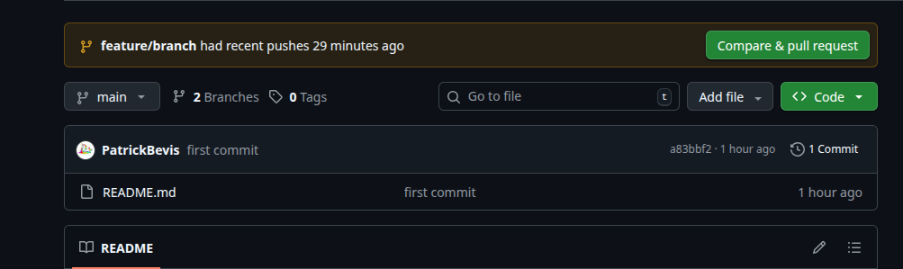
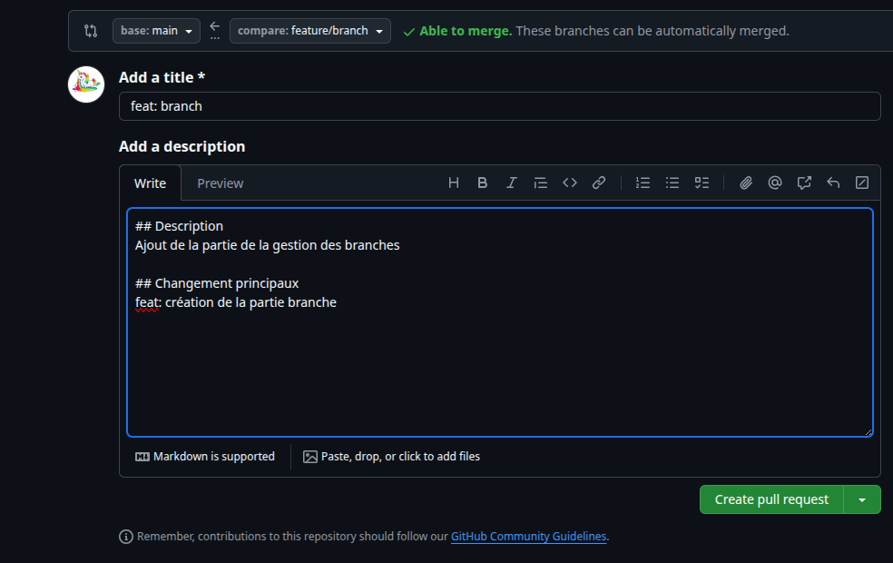
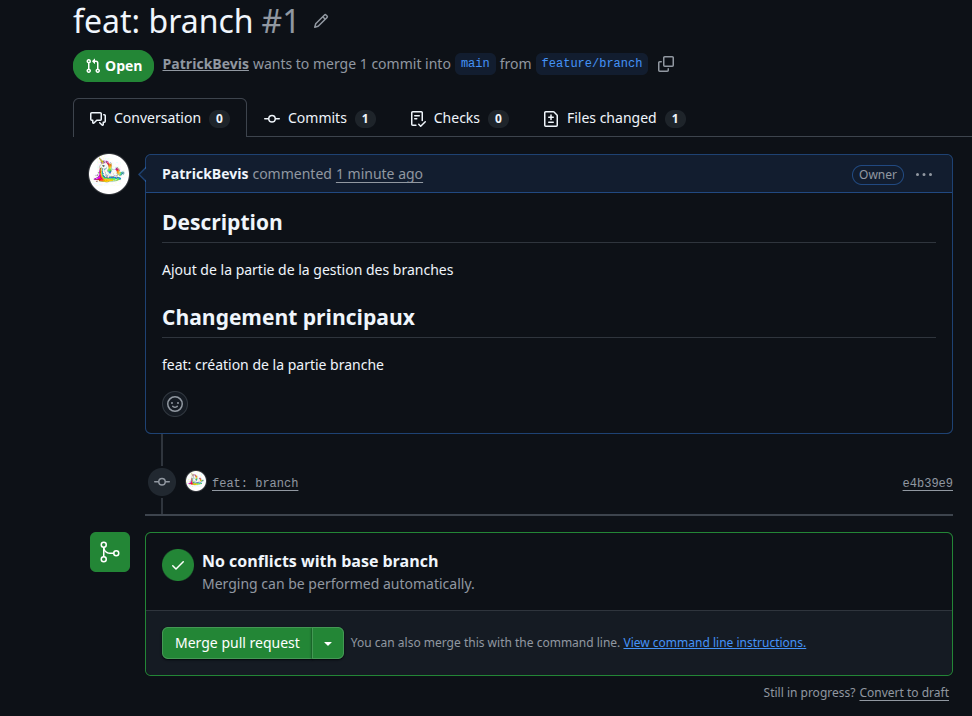
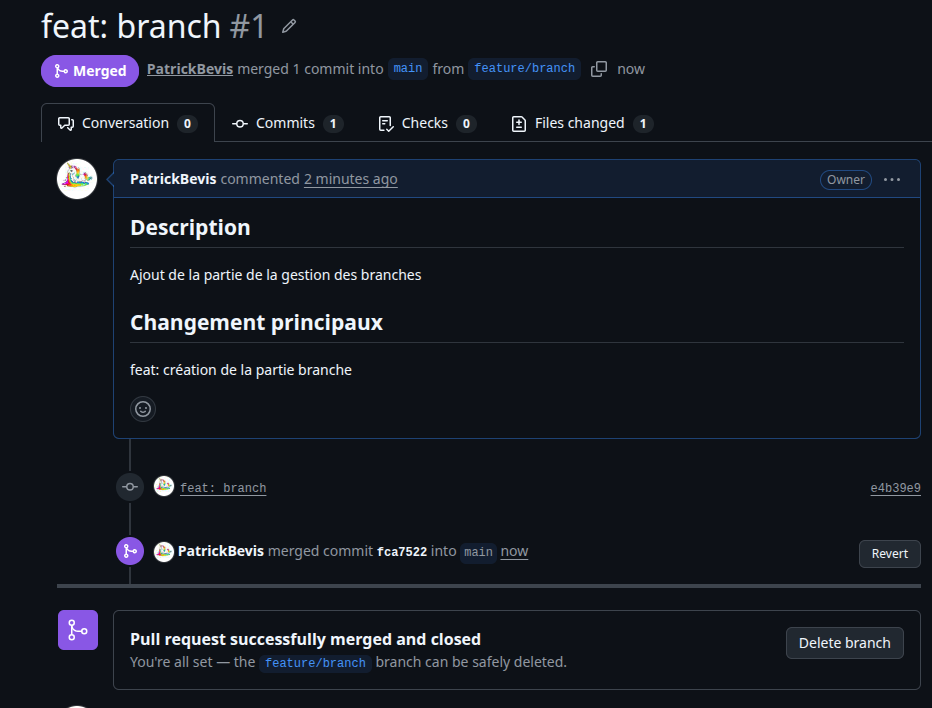

# Documentation GitHub

Cette doc à pour but de donner les commandes de bases et aussi celles plus spécifiques pour une utilisation de GitHub qui soit la meilleure possible. 

## Les commandes de base

Installer Git (linux) :

```bash
sudo apt install git
```


Initialiser un dépôt Git :

```bash
git init
```

Ajouter tous les fichiers :
```bash
git add .
```

Faire un commit :

```bash
git commit -m "First commit"
```

Envoyer les modifications :

```bash
git push
```

Mettre le projet à jour :
```bash
git pull
```

Récupérer un projet :
```bash
git clone <url de la branche>
```

### Pour aller plus loin

Regarder l'état du projet : 

```bash
git status
```

Regarder l'historique :

```bash
git log
```

## Travailler avec les branches

### Les commandes

Les branches sont surtout utilisées pour le travail d'équipe, on ne va pas directement programmer sur la branche **main**


Créer une branche :

Pour la création de branche, il existe plusieurs façons de procéder 

- Utiliser ton nom

```bash
git checkout -b yourName
```
- Utiliser le type de fonctionnalité et une description de celle-ci (on peut ajouter également le numero de ticket associé si il y a)
  
```bash
git checkout -b feature/123-feature-name
```
Changer de branche :

```bash
git checkout main
```
Lister les branches :
```bash
git branch
```

### Dans GitHub

Dans cette partie, on va voir comment gérer les Pull Request (PR) directement dans l'interface de GitHub




Après avoir push, allez sur GitHub et cliquer sur le bouton **`Compare & PR`**



A ce moment là, on voit que le merge est possible (able to merge). Il faut ajouter une description (en md) pour que la personne qui doit valider la PR puisse comprendre facilement ce que vous avez fait. Maintenant il faut cliquer sur le bouton **`Create PR`**



A partir de maintenant si vous êtes la personne qui contrôle et gère les PR, c'est à vous de jouer. Vous regardez la description et le code qui a été push. Dans ce cas de figure, la description est correcte et il n'y a pas de conflits, on peut donc cliquer sur le bouton **`Merge PR`**



Le commit a bien été merged, tout s'est bien passé. On peut delete la branche si on ne compte plus travailler dessus.

## Les mots clés

Au moment de créer les commits et les branches par exemple, il existe des mots clés pour comprendre rapidement ce que les autres ont fait. Voici une petite liste de ces mots.
  
  - feat (Nouvelle fonctionnalité)
  - fix (Correction des bugs)
  - test (Ajout ou modification de test)
  - docs (Documentation)
  
  Il existe d'autres mots mais c'est un bon début pour une personne qui débute
  
## Bonnes pratiques

- Ne jamais travailler directement sur main
- Faire des commits clairs
- Une feature = une branche
- Faire une Pull Request